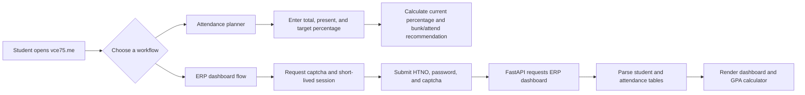

# VCE75 — Student Attendance Portal

[](https://www.vce75.me/)
[](https://github.com/mr-rithish/catt)
[](https://github.com/mr-rithish/zatt)
[](https://vce-ckdjcdajdfgedhcm.centralindia-01.azurewebsites.net/docs)

**VCE75** is a full-stack student attendance companion for Vardhaman College of Engineering students. It combines a fast attendance and bunk planner with an ERP-powered attendance dashboard, subject-wise analytics, target-attendance calculations, and a credit-weighted GPA calculator.

---

## Table of contents

- [Why this project exists](#why-this-project-exists)
- [Features](#features)
- [Product flow](#product-flow)
- [Architecture](#architecture)
- [Repository structure](#repository-structure)
- [API design](#api-design)
- [Local development](#local-development)
- [Deployment](#deployment)
- [Security and privacy considerations](#security-and-privacy-considerations)
- [Engineering decisions and trade-offs](#engineering-decisions-and-trade-offs)
- [Current limitations](#current-limitations)
- [Roadmap](#roadmap)
- [Contributing](#contributing)
- [License](#license)

---

## Why this project exists

Students often need a quick answer to a practical question: **"How many classes can I miss and still maintain my target attendance?"** VCE75 turns that calculation into a simple interface and extends it into a personal academic dashboard when live ERP data is available.

The project solves three related problems:

1. It gives students an immediate attendance estimate without requiring a login.
2. It presents attendance data in a more readable form than a raw ERP table.
3. It puts attendance planning and GPA estimation in one focused, mobile-friendly interface.

## Features

| Area | What it provides |
| --- | --- |
| **Attendance planner** | Calculates current attendance, the maximum number of future classes that can be skipped, or the number of consecutive classes that must be attended to reach a target percentage. |
| **ERP login flow** | Uses the VCE ERP login page, hidden ASP.NET form fields, a captcha, and a short-lived server-side session to retrieve attendance data. |
| **Student dashboard** | Displays student identity, year, semester, section, academic year, and academic period. |
| **Attendance summaries** | Shows overall, regular, and other attendance summaries with percentage-based status indicators. |
| **Subject analytics** | Presents held, present, absent, extra, percentage, and status values for each subject. |
| **Target calculator** | Lets a student change the target percentage and immediately see whether they need to attend more classes or can safely bunk future classes. |
| **GPA calculator** | Calculates a credit-weighted GPA using the grade-point scale `A+ = 10`, `A = 9`, `B+ = 8`, `B = 7`, `C = 6`, `D = 5`, `F = 0`. Incomplete or zero-credit rows are ignored. |
| **Responsive UI** | Dark, responsive interface designed for both desktop and smaller screens. |

## Product flow



The planner runs entirely in the browser using local component state. The ERP flow is different: the browser requests a captcha and session token from the FastAPI service, submits the student's credentials and captcha, and receives normalized student and attendance data for the React dashboard.

## Architecture

VCE75 is split into a React frontend and a Python backend. The frontend owns presentation, validation, attendance calculations, table rendering, and GPA calculations. The backend acts as a short-lived integration layer between the browser and the college ERP system.

| Layer | Technology | Responsibility |
| --- | --- | --- |
| Frontend | React 18, TypeScript, Vite, Tailwind CSS | UI, client-side calculations, state management, parsing normalized response data, and responsive presentation. ([`package.json`](./package.json)) |
| Frontend API client | TypeScript `fetch` service | Starts the captcha flow, completes login, handles expired sessions, and maps API errors to user-facing errors. ([`src/services/api.ts`](./src/services/api.ts)) |
| Backend | FastAPI and Uvicorn | Exposes login-session endpoints, communicates with the ERP, and returns parsed attendance data. ([`zatt/main.py`](https://github.com/mr-rithish/zatt/blob/main/main.py)) |
| ERP integration | Requests, BeautifulSoup, Pandas, lxml | Preserves ERP cookies, extracts ASP.NET hidden fields, retrieves the captcha, parses HTML tables, and normalizes records. ([`zatt/requirements.txt`](https://github.com/mr-rithish/zatt/blob/main/requirements.txt)) |
| Frontend hosting | Vercel-compatible static build | Builds the Vite application into `dist` and rewrites application routes to `index.html`. ([`vercel.json`](./vercel.json)) |
| Backend hosting | Azure App Service | Hosts the FastAPI service at `vce-ckdjcdajdfgedhcm.centralindia-01.azurewebsites.net`. |

## Repository structure

This repository (`catt`) is the main frontend application. It also contains a `backend/` directory with a reference copy of the Python service and a legacy `api/attendance.js` Vercel serverless function retained from an earlier one-step integration approach.

```
catt/
├── api/
│   └── attendance.js              # Vercel serverless proxy
├── backend/                       # Backend copy kept with the frontend for reference
│   ├── main.py
│   ├── requirements.txt
│   └── startup.txt
├── public/
│   ├── manifest.json
│   ├── robots.txt
│   └── sitemap.xml
├── src/
│   ├── components/
│   │   ├── AttendanceDashboard.tsx
│   │   ├── GpaCalculator.tsx
│   │   └── LoginPage.tsx
│   ├── services/
│   │   └── api.ts
│   ├── types/
│   │   └── attendance.ts
│   ├── utils/
│   │   └── attendanceParser.ts
│   ├── App.tsx
│   ├── index.css
│   └── main.tsx
├── package.json
├── vercel.json
└── vite.config.ts
```

The standalone backend repository ([`zatt`](https://github.com/mr-rithish/zatt)) contains the deployable service and its Azure workflow:

```
zatt/
├── .github/workflows/main_vce75.yml
├── main.py
├── requirements.txt
├── startup.txt
└── README.md
```

## API design

The live FastAPI service exposes a two-step captcha flow. Its OpenAPI document is available at [`/openapi.json`](https://vce-ckdjcdajdfgedhcm.centralindia-01.azurewebsites.net/openapi.json), and the interactive documentation is available at [`/docs`](https://vce-ckdjcdajdfgedhcm.centralindia-01.azurewebsites.net/docs).

| Method | Endpoint | Purpose | Response behavior |
| --- | --- | --- | --- |
| `GET` | `/start_login` | Opens an ERP session, extracts the current hidden fields, downloads the captcha, and creates a temporary session token. | Returns `session_token` and a base64-encoded `captcha_image_base64`. |
| `POST` | `/complete_login` | Submits `session_token`, `htno`, `password`, and `captcha`; then fetches and parses attendance data. | Returns `student_info`, `overall_summary`, and `subject_summary` on success. |
| `GET` | `/session_status/{token}` | Checks whether a temporary session token is still valid. | Returns a validity flag and remaining lifetime, or an error message. |

A successful attendance response has the following high-level shape:

```json
{
  "student_info": {
    "HTNO": "...",
    "Student Name": "...",
    "Year": "...",
    "Semester": "...",
    "Section": "...",
    "Acad. Year": "...",
    "Start Date": "...",
    "End Date": "..."
  },
  "overall_summary": [],
  "subject_summary": []
}
```

The backend keeps ERP cookies and hidden form values in an in-memory session for approximately five minutes, periodically removes expired sessions, and cleans up the session after a successful or failed completion attempt. It does not use a database for attendance storage in the current implementation.

## Local development

### Prerequisites

Install **Node.js 18 or newer** and **Python 3.10 or newer**. The frontend uses npm scripts defined in [`package.json`](./package.json). The backend (in the separate [`zatt`](https://github.com/mr-rithish/zatt) repo, or the `backend/` reference copy here) uses the dependencies listed in `requirements.txt`.

### Run the frontend

```bash
git clone https://github.com/mr-rithish/catt.git
cd catt
npm install
npm run dev
```

Vite starts the development server on port `3000` (see [`vite.config.ts`](./vite.config.ts)). Available scripts:

| Script | Purpose |
| --- | --- |
| `npm run dev` | Start the local development server. |
| `npm run build` | Create a production build. |
| `npm run preview` | Preview the production build locally. |
| `npm run lint` | Run ESLint. |

### Run the backend

```bash
git clone https://github.com/mr-rithish/zatt.git
cd zatt
python3 -m venv .venv
source .venv/bin/activate
pip install -r requirements.txt
uvicorn main:app --reload --host 0.0.0.0 --port 8000
```

The backend's deployment startup command is documented in `startup.txt`:

```
uvicorn main:app --host 0.0.0.0 --port 8000
```

### Connecting the two locally

For a complete local frontend/backend integration, point the frontend API client at your local FastAPI base URL instead of the deployed Azure URL. The current client contains the Azure URL directly in [`src/services/api.ts`](./src/services/api.ts), so introducing a Vite environment variable such as `VITE_API_BASE_URL` is a recommended next step for local development and multi-environment deployments.

## Deployment

| Deployment | URL | Source configuration |
| --- | --- | --- |
| Frontend | [www.vce75.me](https://www.vce75.me/) | Vite build plus [`vercel.json`](./vercel.json) |
| Backend API | [Azure App Service](https://vce-ckdjcdajdfgedhcm.centralindia-01.azurewebsites.net/docs) | Uvicorn startup command plus GitHub Actions workflow in `zatt` |
| API schema | [`/openapi.json`](https://vce-ckdjcdajdfgedhcm.centralindia-01.azurewebsites.net/openapi.json) | Generated by FastAPI |

The frontend repository is configured as a Vite static build for Vercel: the build output is `dist`, asset paths are preserved, and application requests are rewritten to `index.html` through `vercel.json`.

The backend is deployed as an Azure App Service. The `zatt` repository includes a GitHub Actions workflow (`main_vce75.yml`), and the service exposes FastAPI's OpenAPI and Swagger UI endpoints for operational inspection.


### Related repositories

- Frontend (this repo): [`mr-rithish/catt`](https://github.com/mr-rithish/catt)
- Backend: [`mr-rithish/zatt`](https://github.com/mr-rithish/zatt)
- Live app: [vce75.me](https://www.vce75.me/)
- Live API docs: [Swagger UI](https://vce-ckdjcdajdfgedhcm.centralindia-01.azurewebsites.net/docs)
